<div align="center">
  
</div>

<div align="center">
  <a href="https://github.com/AgCat80">
    
  </a>
</div>

<br/>

```console
gulian@agcat80:~$ whoami
Aspiring data engineer and software developer building systems that move,
transform, and expose data. Former Head of IT at Legates Group. Currently
completing a BSc in Computing at STADIO — building in public along the way.
```

---

### `01 // About`

I like building things that actually work. My focus is shifting into **data engineering** — pipelines, warehouses, and the infrastructure that turns raw data into something useful. My foundation comes from two years running real IT operations at Legates Group and completing a Higher Certificate in Software Development at Eduvos.

- Currently building a **live SA economic data pipeline** (ETL · DuckDB · Streamlit)
- Competed in **Entelect HackIT 2026** — placed #124 out of 990+ competitors
- **Golden Key International Honour Society** member — top 15% academic cohort
- Documenting the journey on **[YouTube → alien_inc404](https://www.youtube.com/@alien_inc404)**

---

### `02 // Build matrix`

<div align="center">
  
</div>

---

### `03 // Selected work`

| Project | Signal |
|:---|:---|
| **[SA Economic Data Pipeline](https://github.com/AgCat80/sa-data-pipeline)** | Full ETL pipeline pulling live World Bank and FX data through Bronze → Silver → Gold medallion architecture into DuckDB. Streamlit dashboard with KPIs, charts and pipeline audit log |
| **[Photospheria Solver — HackIT 2026](https://github.com/AgCat80/photospheria-solver)** | Competitive simulation solver built in 5 hours. Phased plant-unlock chain across a 2D cellular automata grid. 15,000+ deterministic planting actions. Rank #124/990+ |
| **[ASP.NET Recipe Web App](https://github.com/AgCat80/csharp-recipe-webapp)** | Full-stack ASP.NET Web Forms application with SOAP web service, SQL Server backend, user auth, recipe management and ratings. Refactored to fix SQL injection and architectural bugs |
| **[ScreenRand](https://github.com/AgCat80/screenrand)** | Python CLI content-idea generator for SA creators. Category-based random ideas, platform guides, weekly schedule generator, JSON history persistence |
| **[Hangman + Word Puzzle — Java](https://github.com/AgCat80/hangman-java)** | Two console games in Java. Hangman features SA-themed word categories and an ASCII gallows. Word Puzzle has three game modes with a tech vocabulary bank |

<div align="center">
  <a href="https://github.com/AgCat80?tab=repositories">
    
  </a>
</div>

---

### `04 // Engineering signal`

| Focus | What I build with it |
|:---|:---|
| **Data Engineering** | Python, DuckDB, Pandas, ETL pipelines, medallion architecture, REST API ingestion |
| **Backend development** | C#, ASP.NET, ASMX Web Services, SQL Server, parameterised queries |
| **Database design** | SQL Server, MySQL, schema design, normalisation, analytical warehousing |
| **Software fundamentals** | Java, C++, OOP, data structures, algorithms, console applications |
| **IT operations** | Technical support, web management, digital infrastructure, networking |

---

### `05 // Stats`

<div align="center">
  
  
</div>

---

### `06 // Connect`

<div align="center">

  <a href="https://agcat80.github.io/portfolio-website">
    
  </a>
  &nbsp;
  <a href="https://www.linkedin.com/in/gulian-ibrahim">
    
  </a>
  &nbsp;
  <a href="https://www.youtube.com/@alien_inc404">
    
  </a>
  &nbsp;
  <a href="mailto:ibrahimgulian404@gmail.com">
    
  </a>

</div>

---

<div align="center">
  <sub><code>while (learning) { extract(); transform(); load(); }</code></sub>
</div>

